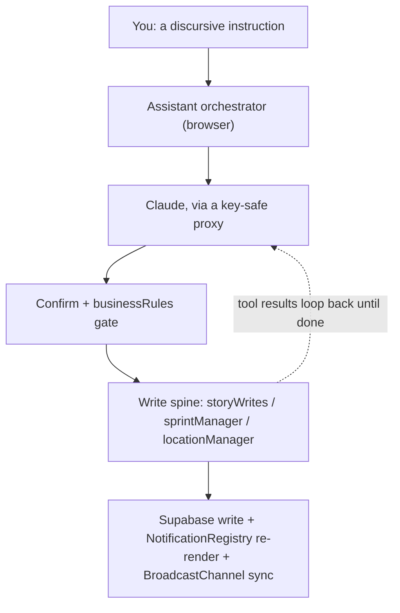

# Design Notes: Conversational assistant for the Capacity Planner

**Author:** JulyAnalytics
**Date:** 2026-06-23
**Status:** Draft — design rationale
**Companion:** [`assistant-chatbot.md`](./assistant-chatbot.md) (the gating feature brief — stores, file touches, friction, regression surfaces). This document is the full elaboration; the brief is the checklist.

---

## 0. What this feature is, in one paragraph

A panel inside the planner where you type prose — instructions (*"drop my trading deep-work to floor while I'm in Lisbon next week"*) or questions (*"what's blocked and why?"*) — and the system turns it into validated, structured changes (or answers) **within the existing framework of the planner**. The model does not get its own database, its own notion of capacity, or its own write path. It is a natural-language front-end to machinery you have already built.

---

## 1. The core realization: you have already built the hard 80%

A conversational assistant that converts discursive intent into structured planner edits needs four capabilities. Three of them already exist in this codebase:

| Capability it needs | Already exists? | Where |
|---|---|---|
| A write path that validates and fans changes out to every view | **Yes** | [`js/storyWrites.js`](../../js/storyWrites.js), `window.sprintManager`, `window.locationManager`, `NotificationRegistry.emit()` → re-render → `BroadcastChannel` |
| A machine-readable description of every store, field, and enum | **Yes** | [`docs/architecture/SCHEMA_REFERENCE.md`](../architecture/SCHEMA_REFERENCE.md) |
| An encoding of the *intent* and legality of each operation | **Yes** | [`js/businessRules.js`](../../js/businessRules.js) — transition whitelists, validators, circular-dependency detection |
| A model that maps prose → structured tool calls | **No** | The only genuinely new piece |

So the right mental model is not "bolt an AI subsystem onto the planner." It is: **the assistant is one more caller of the write spine** — exactly like the SortableJS drag handlers in [`backlogView.js`](../../js/backlogView.js) that were converted into spine callers (`_handleSortableCross`, `_handleSortableReorder`, `_toggleStoryFocus`, `_toggleStoryStatus`), and exactly the pattern ratified in [ADR-0006 (unified story write spine)](../architecture/adr/0006-unified-story-write-spine.md). The novelty is only that the front of this caller is natural language instead of a drag gesture.

This framing produces the single most important design constraint, stated up front so everything else follows from it:

> **The assistant must funnel every write through the existing spine. It must never write to Supabase (`DB.put`) directly, and it must never `NotificationRegistry.emit()` itself.** A direct write would bypass the notification fan-out (views wouldn't refresh) and the `BroadcastChannel` (other tabs would desync) — silently breaking items 1 and 2 of your regression checklist. The whole architecture below exists to honor this.

---

## 2. What "understand the planner structure" actually decomposes into

"Understanding the planner" is not one capability. It is three distinct knowledge sources, each with a different home and a different update cadence. Conflating them is the usual reason naive LLM integrations feel brittle.

### 2.1 Static semantics — the system prompt

The unchanging shape of the world: the hierarchy (Priority Level → Focus → Sub-Focus → Epic → Story), the story/epic/sprint status enums, the fibonacci sizes, the priority bands, and the `DAY_CAPACITY` formula that defines what a "block" is for each day type.

The key observation: **you have already written this knowledge.** [`SCHEMA_REFERENCE.md`](../architecture/SCHEMA_REFERENCE.md) is, almost verbatim, the field reference the model needs. The decision comments in [`businessRules.js`](../../js/businessRules.js) (e.g. *"completed→backlog blocked: cannot reopen a completed story directly"*) are exactly the operating-intent prose the model needs. Compiling the system prompt is largely a matter of concatenating and lightly editing artifacts that already exist.

Because this content is large and changes rarely, it is the natural candidate for **prompt caching** — written once, then read at roughly one-tenth the input cost on every subsequent turn of a conversation. Keep it byte-stable (no timestamps, no per-request IDs interpolated into it) so the cache actually hits.

### 2.2 Live state — context assembly or retrieval

The model also needs *this user's actual data*: which focuses and epics exist, which sprint is active, what's in the backlog, what's blocked. Two ways to supply it:

- **Serialize a compact snapshot into context each turn.** Because this is a single-user personal planner, the dataset is small. A "world summary" — counts per store, the active sprint, the focus→epic tree as names, the list of blocked stories — is cheap to assemble from `app.data` and `hierarchyCache.data` and gives the model enough to plan against.
- **Expose read tools and let the model fetch.** `query_stories`, `query_hierarchy`, `read_capacity` keep the base context lean and scale to larger datasets, at the cost of extra round-trips.

**Recommended:** do both — always include a small serialized world-summary so the model is never flying blind, and provide `query_*` tools for drill-down. The summary answers "what exists?"; the tools answer "tell me precisely about X."

### 2.3 Intent and legality — dual encoding

This is the subtle one, and it is what makes "appropriate utilization of each feature" tractable rather than hand-wavy.

The rules in [`businessRules.js`](../../js/businessRules.js) — the status-transition whitelists (`STORY_TRANSITIONS`, `EPIC_TRANSITIONS`, `SPRINT_TRANSITIONS`), the validators (`validateStory`, `validateSprint`, `validateTravelSegment`), and `detectCircularDependencies` — are encoded **twice**:

1. **In the system prompt**, as prose, so the model *proposes* legal actions ("you can't reopen a completed story directly; abandon it first or create a new one").
2. **In the commit path**, as enforcement, so an illegal action the model proposes anyway is *rejected* before it touches the DB.

The model is advisory about legality; the code is authoritative. This is the same three-layer validation philosophy you already documented in [ADR-0004](../architecture/adr/0004-three-layer-validation.md), extended to a new caller.

---

## 3. The translation layer: discursive → structured

### 3.1 Mechanism: tool use (function calling)

The bridge from prose to structured edits is Anthropic **tool use**. You define a set of tools, each with a JSON `input_schema` derived directly from [`SCHEMA_REFERENCE.md`](../architecture/SCHEMA_REFERENCE.md). The model emits structured `tool_use` blocks with typed arguments; your handler executes the matching function and feeds the result back. For tools that must return a single typed object (e.g. parsing a brain-dump into N story drafts), **structured outputs** (`output_config.format` with a JSON schema) constrain the shape directly.

### 3.2 The tool catalogue maps onto functions you already have

| Intent the user expresses | Tool | Existing function it calls |
|---|---|---|
| "what's blocked?", "what did I overcommit this sprint?" | `query_stories` / `query_hierarchy` | filter over `app.data` |
| "what's my project-block capacity this sprint?" | `read_capacity` | `deriveSprintCapacity` / `deriveCapacityForDateRange` |
| "mark the auth story done", "bump it to primary", "move it to next sprint" | `update_story` | `storyWrites.commitStoryUpdate(id, updates)` |
| "reorder these three" | `reorder_stories` | `storyWrites.commitStoryReorder(ids, field)` |
| "add a story to the Lisbon epic" | `create_story` | extracted record builder + `DB.put` |
| "start a 2-week sprint Monday", "close the current sprint" | `manage_sprint` | `window.sprintManager` |
| "I'm in Lisbon Jun 30–Jul 4" | `set_location` / `set_day_type` | `window.locationManager` |
| "put this epic in June as secondary" | `plan_month` | `DB.addEpicToMonth` / `saveMonthlyPlan` |
| "summarize my Trading focus", "create a Photography epic" | `query_hierarchy` / `create_epic` | hierarchy read / existing creation path |

### 3.3 Two load-bearing details specific to this codebase

**Name resolution, not ID generation.** Your IDs look like `epic-1715472000000-abc123` and `crypto.randomUUID()` — precisely the kind of opaque token an LLM will fabricate if asked to produce one. So the tools accept **human names** ("the Lisbon photography epic"), and a deterministic resolver maps names → IDs against `window.hierarchyCache.data` (`.focuses`, `.subFocuses`, `.epics`, `.sprints`). When a name is ambiguous, the resolver returns a disambiguation prompt rather than guessing. The model stays in natural-language space; your resolver owns ID space. This single decision eliminates the most common class of LLM error in data apps.

**The commit functions do not all validate — the handler must.** Look at [`storyWrites.js`](../../js/storyWrites.js): `commitStoryUpdate` is a bare `Object.assign(story, updates)` followed by `DB.put`. It performs no domain validation. Therefore the *tool handler* for `update_story` must call `businessRules.canTransitionStatus()` and `validateStory()` **before** calling `commitStoryUpdate`. This is the enforcement seam from §2.3, made concrete: validation lives in `assistantTools.js`, between the model's proposal and the spine's commit.

---

## 4. The five infrastructure pieces

### 4.1 (A) Where the model runs — the one real decision

The planner is a static site on Netlify with a Supabase backend. Everything in `dist/*.min.js` is fully inspectable, so **an Anthropic API key cannot live in client JS.** Two viable paths:

- **Single-user shortcut (zero backend).** Because this is a one-user tool (one Supabase identity), store *your own* key in `localStorage` and call the Anthropic API directly from the browser. Fastest to ship; legitimate precisely because you are the only user and it is your key.
- **Proper path (one serverless function).** A **Netlify Function** at `/.netlify/functions/assistant` holds the key, receives the conversation, calls the model, and returns the response. This is mandatory the moment anyone else uses the app. Supabase RLS already scopes every row by `user_id` (`.eq('user_id', this._uid())` throughout [`db.js`](../../js/db.js)), so the function operates safely within the user's data scope.

Start with the shortcut to prototype; design the transport (`js/assistantClient.js`) so swapping in the proxy later is a one-file change.

### 4.2 (B) The tool layer — the "hands," client-side

This is the new module surface:

- `js/assistant.js` — the orchestrator. Exposes `window.assistant`, assembles context, runs the agentic loop, owns the confirmation gate.
- `js/assistantTools.js` — the tool registry: handlers, the name→ID resolver, and the pre-commit validation calls into `businessRules`.

Both run **in the browser**. This is deliberate and important: because tool *execution* happens client-side, every write flows through `storyWrites` / `sprintManager` / `locationManager`, which means the `NotificationRegistry` emits and `BroadcastChannel` posts happen for free. The assistant writes no DOM code and registers no new notification listeners — it inherits the entire render-and-sync machinery by going through the spine.

Build placement: insert these into `build.js`'s `JS_FILES` **immediately before `js/app.js`**. The assistant consumes nearly every spine global (`DB`, `storyWrites`, `businessRules`, `hierarchyCache`, `sprintManager`, `locationManager`, `sprintCapacity`/`locationCapacity`, `constants`), so it must come after all of them; only `app.js`, the orchestrator, should follow it.

### 4.3 (C) The grounding layer

Assembles the system prompt (§2.1) + the live world-summary (§2.2) and hands them to the transport. Keep the static prefix frozen and prompt-cached; append the volatile world-summary after the cache breakpoint so a changing summary never invalidates the cached schema/rules.

### 4.4 (D) The validation / confirmation gate

Reads execute immediately — questions are safe. Writes pass through two checks: (1) `businessRules` validation in the handler, and (2) for multi-record or destructive changes, a human "here's what I'll do" confirmation that previews the exact set of writes before any commit. This is the same caution your manual regression checklist already encodes, surfaced to the user as a plan they approve.

### 4.5 (E) The chat UI

A panel mounted as a tab or a slide-over that talks **only** to `window.assistant`. It never manipulates the DOM of the backlog, calendar, or sprint views — it writes through the spine and lets `NotificationRegistry` repaint them. This keeps the UI surface tiny and the coupling minimal.

---

## 5. The brain/hands split (the agentic loop)

The loop has a deliberate asymmetry:

- **Brain (reasoning) runs remotely** — server-side via the proxy, or via the direct API call — for key safety.
- **Hands (tool execution) run locally** — in the browser, through the spine — so writes fan out to the UI.

One turn: the orchestrator sends the message + context → the model returns `tool_use` blocks → the browser executes them through the spine → results are sent back → the model continues → … → a final natural-language summary. Stream the responses so it feels live; the loop is several round-trips.

---

## 6. Worked example, end to end

You type: *"I'll be in Lisbon Jun 30–Jul 4 doing mostly photography. Drop my trading deep-work to floor for that stretch and don't plan any project blocks."*

1. **Resolve.** `focus "trading"` → `focus-trading` via `hierarchyCache`; gather its stories in sprints overlapping 2026-06-30…07-04.
2. **Propose tool calls.** `set_location({ startDate:'2026-06-30', endDate:'2026-07-04', city:'Lisbon', dayTypes:{ travel:1, buffer:1, stable:2, project:0, social:1 } })` → `locationManager.createLocationPeriod`; plus `update_story` calls setting those trading stories' `priority:'floor'`.
3. **Validate.** The priority value is checked against `PRIORITY_LEVELS` from [`constants.js`](../../js/constants.js); `locationManager` validates the period; any illegal status transition would be rejected by `canTransitionStatus`.
4. **Confirm.** Because this is multi-record, the assistant previews: "① add Lisbon location Jun 30–Jul 4, ② move 3 trading stories to Floor" and waits for approval.
5. **Commit through the spine** → `NotificationRegistry.emit('locationPeriod')` and `emit('story')` → calendar, backlog, and sprint-capacity headers re-render; `BroadcastChannel` syncs other open tabs. The assistant then calls `deriveCapacityForDateRange`, **reads** the result, and narrates: *"That leaves you 0 project blocks and ~4.25 floor blocks across those 5 days."* It performs no arithmetic itself.

---

## 7. Constraints specific to this planner

- **The model never computes capacity.** Your own project memory records that even the original spec had arithmetic errors. Capacity is produced by deterministic functions (`deriveSprintCapacity`, `deriveCapacityForDateRange`, `sprintAllocation`). The model *calls* them and *narrates* — `DAY_CAPACITY` is an oracle it reads, never math it does. This is also the [CRITICAL friction row](../architecture/EXTENSION_MANIFEST.md): `DAY_CAPACITY` must stay byte-unchanged.
- **Funnel through the spine; never touch Supabase directly.** (Restated from §1 because it is the load-bearing invariant.)
- **Two priority vocabularies exist.** [`constants.js:41`](../../js/constants.js) warns that story `priority` uses `primary | secondary1 | secondary2 | floor` while the `DAY_CAPACITY` pools use `priority | secondary1 | secondary2 | floor`. The system prompt must state this explicitly or the model will conflate `primary` (story band) with `priority` (capacity pool).
- **Strangler-fig obligation.** The feature touches `app.js` only to mount the panel, but CLAUDE.md's rule — *every feature touching `js/app.js` extracts one responsibility first* — still fires. The recommended extraction is **tab routing** (a named hotspot candidate), which directly reduces the friction this feature pays to register its view. See the brief's Friction check.
- **Maintenance protocol.** Adding the modules means updating `build.js`, the [`SYSTEM_MAP.md`](../architecture/SYSTEM_MAP.md) module table + build order, registering `window.assistant`, and bumping the CLAUDE.md version line.

---

## 8. Read-first roadmap

Ship value before risk. Each phase is independently shippable.

| Phase | Scope | Tools | Risk profile |
|---|---|---|---|
| 1 | **Read-only advisor** | `query_*`, `read_capacity` | Zero write blast radius; proves the model understands the planner. Only `app.js` touch is mounting the panel. |
| 2 | **Single-entity writes behind confirm** | `update_story`, `reorder_stories`, `create_story` | Each validated, each confirmed. Exercises the enforcement seam. |
| 3 | **Multi-step plans** | `manage_sprint`, `set_location`, `set_day_type`, `plan_month` | The Lisbon example; leans on `commitStoryUpdate`'s existing in-memory rollback for partial-failure safety. |
| 4 | **Proactive / advisory** | (read-driven) | Surfaces over-allocations: "9 primary-band stories, 4 primary blocks this sprint — demote three?" |

Phase 1 is where you learn the most for the least cost: it tells you whether the grounding (§2) actually makes the model fluent in your domain, before any write tool exists.

---

## 9. Costs, risks, and why each failure mode is bounded

- **Model.** Default `claude-opus-4-8` for the planning/reasoning loop — decomposing prose into a legal multi-step plan is the whole job, and that is where the strongest model pays off. Routing trivial sub-steps (pure name resolution) to `claude-haiku-4-5` is an optional cost lever, your call. Prompt-caching the static schema/rules prefix is the main lever for both cost and latency.
- **Latency.** The agentic loop is several round-trips; stream responses so it reads as live progress rather than a long pause.
- **Failure modes are bounded by construction:**

  | Failure mode | What catches it |
  |---|---|
  | Hallucinated entity ID | The name→ID resolver (§3.3) — the model never emits IDs |
  | Illegal operation (e.g. completed→backlog) | `businessRules` validation in the handler, before commit |
  | Wrong capacity arithmetic | Structurally impossible — the model doesn't do arithmetic; it reads `derive*` functions |
  | Destructive or multi-record change | The confirmation gate (§4.4) |
  | Legal-but-wrong change (the residual risk) | The confirmation gate — this is exactly what the human preview is for |

The residual risk after all the deterministic guards is the model proposing something legal but not what you meant. That is irreducible for any natural-language interface, and it is precisely why writes are gated behind a preview-and-confirm step rather than executed silently.

---

## 10. Summary: what you reuse vs. what you build

| Reuse (existing planner spine) | Build (new) |
|---|---|
| `storyWrites`, `sprintManager`, `locationManager`, monthly-plan helpers | `js/assistant.js` (orchestrator + `window.assistant`) |
| `businessRules` validators + transition whitelists | `js/assistantTools.js` (tool registry, resolver, pre-commit validation) |
| `NotificationRegistry` + `BroadcastChannel` fan-out | `js/assistantClient.js` (transport: stored key now, proxy later) |
| `hierarchyCache` (name→ID resolution source) | The chat panel UI |
| `deriveSprintCapacity` / `deriveCapacityForDateRange` (the capacity oracle) | The system prompt (compiled from existing docs) |
| `SCHEMA_REFERENCE.md` (→ tool `input_schema`s) | Tab-routing extraction (strangler-fig prerequisite) |
| Supabase RLS (`user_id` scoping) | *Optional:* `assistantThreads` store for chat persistence |

The ratio is the whole point: the assistant is mostly wiring over machinery that already exists.
